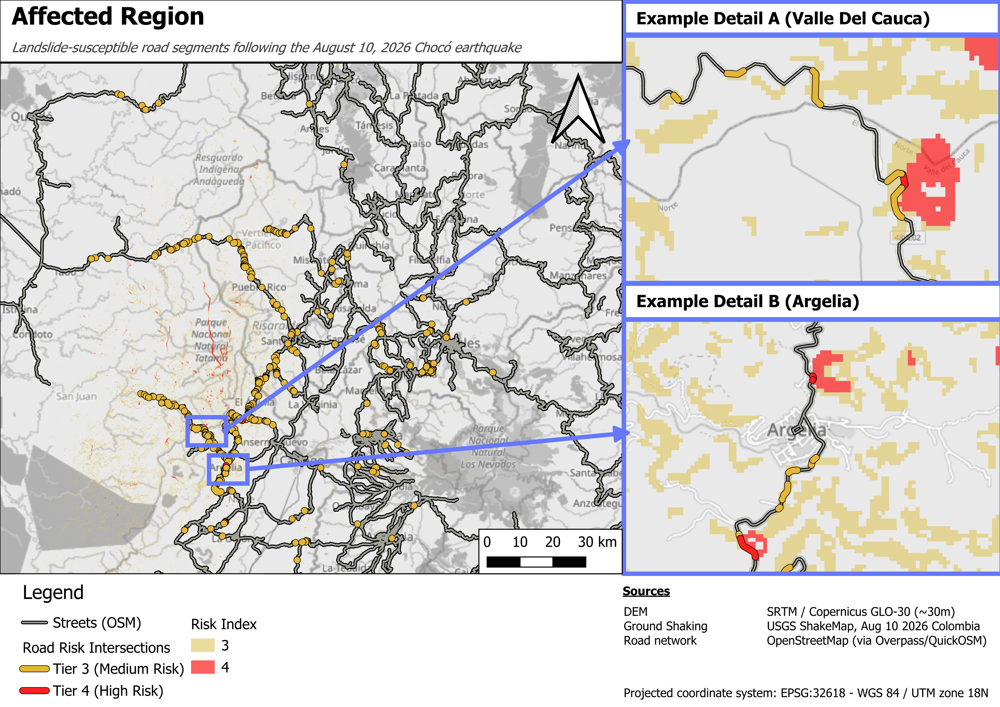

# Chocó–Coffee Region Landslide Road-Risk Analysis

**Which roads are most likely to be cut off by landslides after the August 10, 2026 Colombia earthquake — and where should ground assessment or reinforcement be prioritized first?**


*Medium (tier 3) and high (tier 4) landslide-susceptibility road intersections across Chocó, Risaralda, Caldas, and Quindío.*

---

## TL;DR

- Built a landslide-susceptibility index by combining terrain slope (from a 30m DEM) with earthquake ground-shaking intensity (USGS ShakeMap) for the Aug 10, 2026 Colombia earthquake.
- Intersected the highest-susceptibility zones with the OSM road network to flag **366 primary/secondary/tertiary road segments** at elevated risk of being blocked.
- Output is a prioritized, mappable list — intended to support rapid post-earthquake road-clearance triage, not as a substitute for on-the-ground geotechnical assessment.
- **This is a portfolio/methodology project**, built with open data and no ground-truth landslide inventory for validation. See [Limitations](#limitations--what-id-do-differently) before using this for anything operational.

---

## Why this matters

After a major earthquake in mountainous terrain, landslides — not just building damage — are often what isolates communities, by cutting the roads that emergency response, medical evacuation, and supply chains depend on. Knowing *in advance*, or within hours, which specific road segments sit in high-susceptibility terrain lets responders prioritize where to send reconnaissance first, rather than discovering blockages one washed-out road at a time.

This project asks a decision-relevant question — *which roads, specifically* — rather than just mapping general hazard.

---

## Method summary

| Step | Input | Tool |
|---|---|---|
| 1. Terrain slope | 30m DEM (SRTM/Copernicus GLO-30) | QGIS Slope (GDAL) |
| 2. Ground shaking | USGS ShakeMap, Aug 10 2026 event | QGIS raster tools |
| 3. Normalize + combine | Slope × shaking intensity | Raster Calculator |
| 4. Classify | Continuous risk raster → 5 discrete tiers (histogram-driven, right-skewed distribution) | Reclassify by table |
| 5. Vectorize | Tiers 3–4 (medium/high) only; sub-pixel noise (<5,000m²) filtered | GDAL Polygonize |
| 6. Intersect | Risk polygons × OSM road network (primary/secondary/tertiary) | Vector Intersection |
| 7. Sanity check | Cross-referenced against reported road closures (INVÍAS, media reporting) | Manual review |

**Result:** 366 road–risk intersection features, each tagged with road class (`highway`) and risk tier (`risk_tier`), ready to prioritize by road importance × risk severity.

Full methodology, equations, threshold justification, and QGIS-specific workflow notes: **[docs/methodology.md](docs/methodology.md)**

---

## Data sources

| Dataset | Source | Notes |
|---|---|---|
| Digital Elevation Model | SRTM / Copernicus GLO-30 (~30m) | See `data/raw/SOURCES.md` for download links |
| Earthquake ground shaking | USGS ShakeMap, Aug 10 2026 Colombia event | |
| Road network | OpenStreetMap (via Overpass/QuickOSM), `highway` = primary/secondary/tertiary | |
| Validation reference | INVÍAS, Servicio Geológico Colombiano (SGC), UNGRD, Copernicus EMS, contemporaneous news reporting | Used for qualitative sanity-check only, not calibration |

---

## Limitations & what I'd do differently

This is an **illustrative methodology project** built entirely from open data, without access to geotechnical ground-truth or a calibrated landslide susceptibility model. Specifically:

- **The risk index is a proxy, not a validated geotechnical model.** Rigorous landslide-triggering analysis (e.g. Newmark sliding-block or Arias-intensity methods) requires soil mechanics inputs — cohesion, friction angle, saturation — that aren't available from open global datasets. Slope × shaking intensity is a reasonable, defensible proxy for *relative* susceptibility, but it is not a substitute for those methods.
- **No calibration against an actual landslide inventory.** Tier boundaries were set by inspecting the histogram of the combined index (heavily right-skewed) rather than against observed landslide occurrence. With access to a post-event landslide inventory (e.g. from satellite change detection), thresholds could be tuned and validated properly.
- **30m DEM resolution** means small/localized slope failures below that resolution aren't resolvable; sub-pixel-scale polygons (<5,000m²) were filtered as likely noise rather than genuine risk features.
- **Given more time**, next steps would be: (1) validate against a NASA/Copernicus rapid-response landslide inventory if one becomes available for this event, (2) incorporate rainfall/soil moisture antecedent conditions, (3) weight road prioritization by redundancy (is this the *only* route to a community, or is there an alternative).

---

## Repo structure

```
├── outputs/
│   ├── maps/              final map exports (PNG/PDF)
│   └── data/              final GeoJSON/GPKG — the road-risk intersection layer
├── data/
│   └── raw/SOURCES.md     where to download the raw inputs (not committed — see below)
├── docs/
│   └── methodology.md     full methodology, equations, decisions, QGIS workflow
└── README.md
```

Raw source rasters (DEM, ShakeMap) are not committed to this repo due to file size — `data/raw/SOURCES.md` has direct download links to reproduce them.

---

## Author

Built as part of a self-directed GIS/geospatial learning path (UC Davis GIS Specialization, QGIS-based), targeting applied climate/disaster-risk work. [LinkedIn](https://www.linkedin.com/in/hanns-niedermark/) · [Website](https://hannsniedermark.com)
